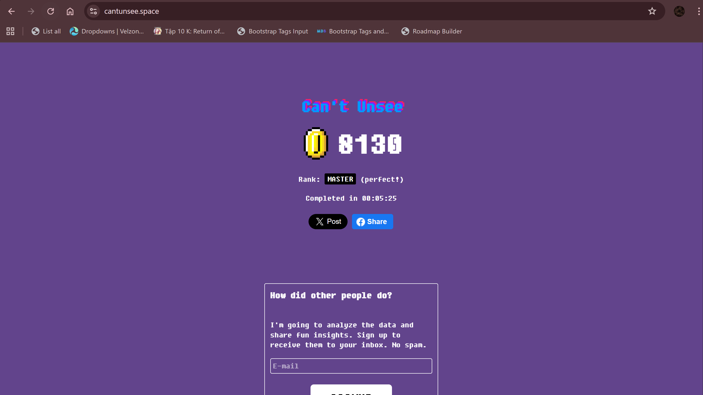
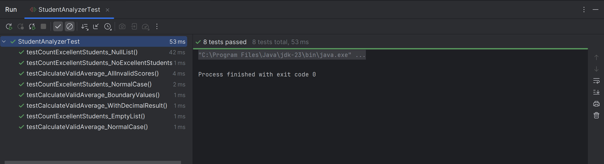
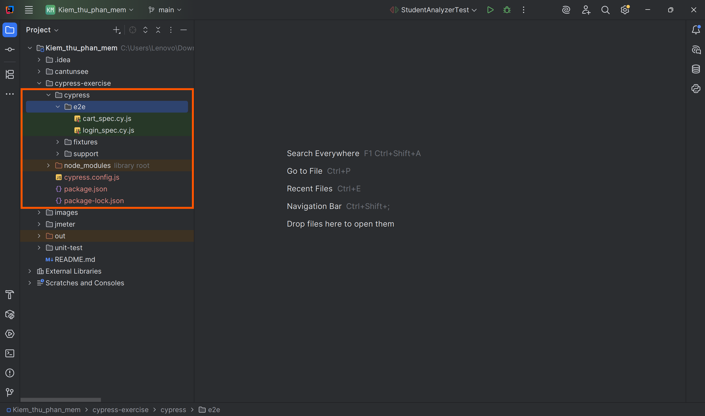
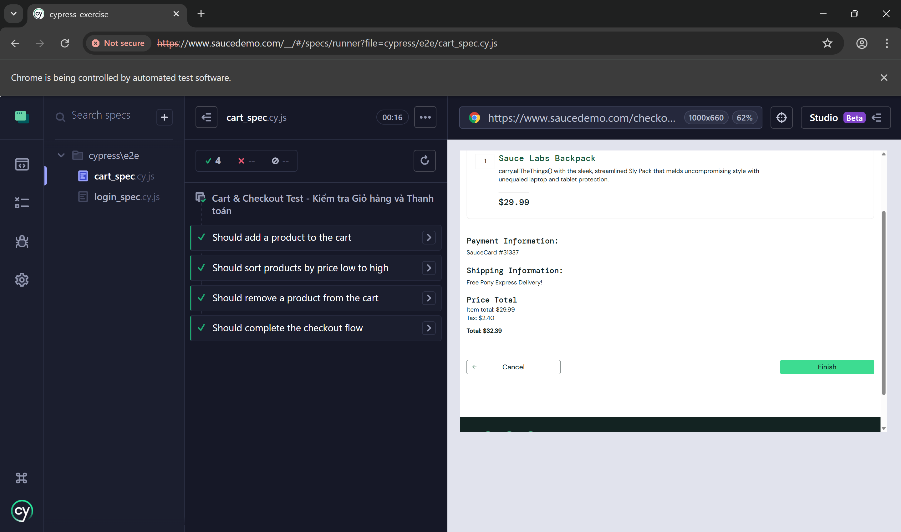
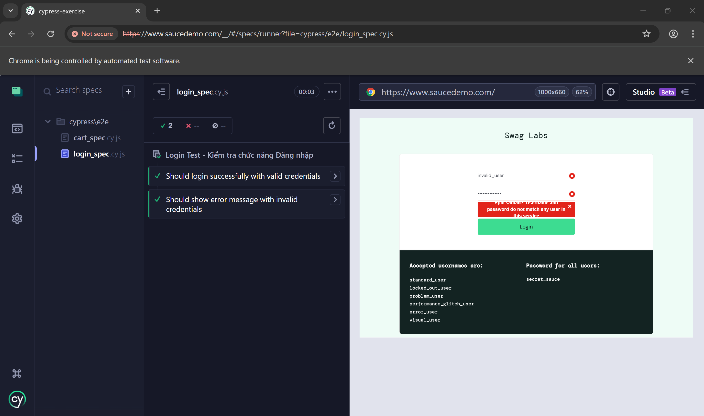
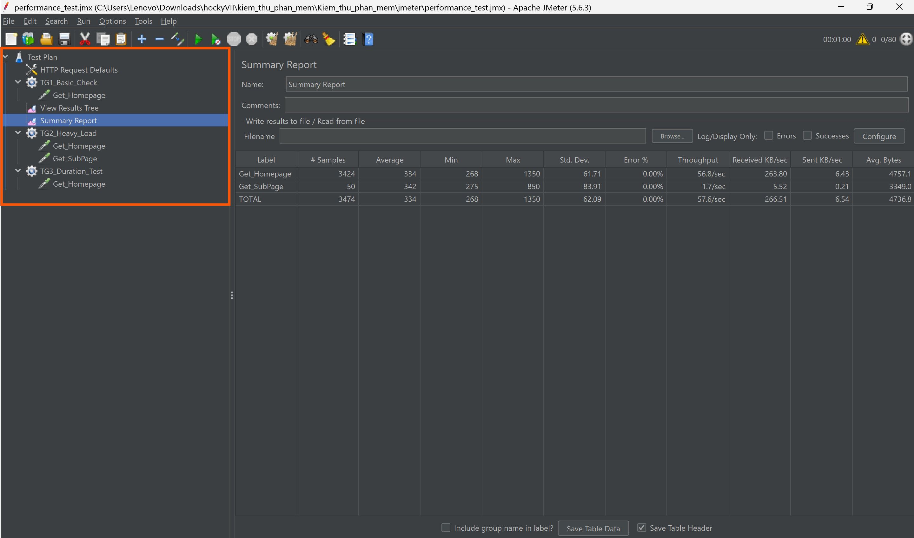
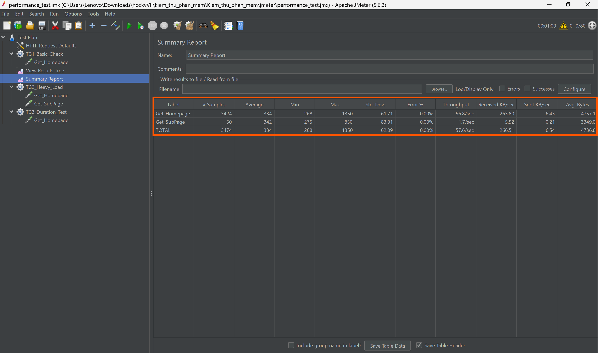

# 📘 Portfolio: Software Testing

> **A repository for practical exercises, source code, and learning reports.**

* **Student:** Doan Hoang Quan
* **Student ID:** BCS230070
* **Class:** 23CS2
* **Status:** 🟢 In Progress

---

## Table of Contents

1. [Overview](https://www.google.com/search?q=%23-overview)
2. [Repository Structure](https://www.google.com/search?q=%23-repository-structure)
3. [Chapter 1: Testing Principles](https://www.google.com/search?q=%23-chapter-1-testing-principles)
4. [Chapter 2: Testing Process](https://www.google.com/search?q=%23-chapter-2-testing-process)
5. [Chapter 3: Automated Testing](https://www.google.com/search?q=%23-chapter-3-automated-testing)
6. [Chapter 4: Performance Testing](#-chapter-4-performance-testing)

---

## 🌐 Overview

This project serves as a comprehensive collection of practical work for the Software Testing course. The objective ranges from training the mindset to detect interface defects ("Pixel Perfect"), to writing rigorous unit tests, and finally building End-to-End (E2E) automated test scenarios.

**Technology Stack:**

* **Languages:** Java (JUnit), JavaScript (Cypress).
* **Tools:** IntelliJ IDEA/Eclipse, VS Code, Git.
* **Frameworks:** JUnit 5, Cypress.io.

---

## 📂 Repository Structure

```text
Kiem_thu_phan_mem/
├── cantunsee/              # Chapter 1 Exercises
├── unit-test/              # Chapter 2 Exercises (Java Project)
├── cypress-exercise/       # Chapter 3 Exercises (Cypress Project)
├── jmeter/                 # Chapter 4 Exercises (JMeter Project)  <-- THÊM DÒNG NÀY
│   ├── performance_test.jmx
│   └── results.csv
├── images/                 # Test Evidence Storage
└── README.md               # This Documentation File

```

---

## 🎨 Chapter 1: Testing Principles

**Goal:** Train observation skills ("Pixel Perfect") and distinguish UI design errors through the [Can't Unsee](https://www.google.com/search?q=https://cantunsee.space/) game.

* **Activities:** Analyze Contrast, Typography, Alignment, and Padding.
* **Result:** Completed levels from basic to advanced.

**📸 Evidence:**



---

## ☕ Chapter 2: Testing Process

**Goal:** Apply JUnit 5 to test the student score processing logic (`StudentAnalyzer`). Ensure the code meets Clean Code standards and handles boundary cases effectively.

* **Problem:** Process a list of scores (`List<Double>`), count the number of excellent students, and calculate the valid average score.
* **Applied Techniques:**
* Boundary Value Analysis.
* Equivalence Partitioning.
* Refactoring & Clean Code (Method extraction, constant usage).

**✅ Test Cases:**

### ✅ Danh sách Test Cases

Bảng dưới đây liệt kê các kịch bản kiểm thử (Test Scenarios) đã được bao phủ trong `StudentAnalyzerTest.java`:

| ID | Function | Input Data | Scenario / Description | Expectation | Result |
| :--- | :--- | :--- | :--- | :--- | :--- |
| **TC_01** | `countExcellentStudents` | `[9.0, 8.5, 7.0, 11.0, -1.0, 8.0]` | Mixed valid & invalid scores | `3` (Chỉ đếm >= 8.0, bỏ qua điểm sai) | ✅ PASS |
| **TC_02** | `countExcellentStudents` | `[9.0, null, 8.0, null]` | **List contains `null`** | `2` (Bỏ qua `null` an toàn, không crash) | ✅ PASS |
| **TC_03** | `countExcellentStudents` | `[7.9999, 8.0]` | **Boundary Precision** | `1` (7.9999 không được làm tròn lên) | ✅ PASS |
| **TC_04** | `countExcellentStudents` | `[]` (Empty List) | Empty List | `0` | ✅ PASS |
| **TC_05** | `countExcellentStudents` | `null` | **Null List Input** | `0` (Xử lý ngoại lệ an toàn) | ✅ PASS |
| **TC_06** | `countExcellentStudents` | `[5.0, 6.0, 7.9]` | No excellent students | `0` | ✅ PASS |
| **TC_07** | `calculateValidAverage` | `[9.0, 7.0, 8.0, 15.0]` | Mixed valid & invalid scores | `8.0` (Tổng 24.0 / 3 phần tử hợp lệ) | ✅ PASS |
| **TC_08** | `calculateValidAverage` | `[10.0, null, 5.0]` | **List contains `null`** | `7.5` (Bỏ qua `null` khi tính toán) | ✅ PASS |
| **TC_09** | `calculateValidAverage` | `[-5.0, 20.0, null]` | All Invalid or Null | `0.0` (Tránh lỗi chia cho 0 / NaN) | ✅ PASS |
| **TC_10** | `calculateValidAverage` | `[]` (Empty List) | Empty List | `0.0` | ✅ PASS |
| **TC_11** | `calculateValidAverage` | `null` | **Null List Input** | `0.0` | ✅ PASS |
| **TC_12** | `calculateValidAverage` | `[10.0, 9.0]` | Decimal Result | `9.5` (Kết quả số thực chính xác) | ✅ PASS |

**📸 Evidence:**



---

## 🌲 Chapter 3: Automated Testing

**Goal:** Use Cypress to automate the purchasing process on [SauceDemo](https://www.saucedemo.com).

* **Scope:** Functional, Interface, and Business Flow testing.
* **Highlights:**
* **Best Practices:** Used `[data-test]` selectors, avoided hard-coded waits.
* **Advanced Scenarios:** Implemented Product Removal Flow and Full Checkout Flow.


**✅ Test Scenarios:**

1. **Login Flow:** Verify successful and failed login attempts.
2. **Shopping Flow:** Add product -> Verify cart icon updates quantity.
3. **Filter Flow:** Sort Price Low -> High (Verify data display accuracy).
4. **Cart Management (Advanced):** Add product -> Remove product -> Verify icon updates.
5. **Checkout Process (Advanced):** Cart -> Checkout Info -> Overview Page.

**How to run tests:**

```bash
cd cypress-exercise
npm install
npx cypress open

```

**📸 Evidence:**







---

## 🚀 Chapter 4: Performance Testing

**Goal:** Analyze the performance and stability of the [BlazeDemo](https://blazedemo.com) website using **Apache JMeter**.

* **Tools:** Apache JMeter 5.6.3.
* **Target:** Verify response times and server stability under different load conditions.
* **Scenarios:** Basic Check, Heavy Load, and Endurance Test.

**✅ Test Scenarios:**

| Thread Group | Users | Ramp-up | Loop/Duration | Description | Result |
| :--- | :--- | :--- | :--- | :--- | :--- |
| **TG1_Basic** | 10 | 1s | 5 | Access Homepage to verify connectivity. | PASS |
| **TG2_Heavy** | 50 | 30s | 1 | Simulate high traffic accessing Homepage & Vacation Page. | PASS |
| **TG3_Duration** | 20 | 10s | 60s | Sustain load for 1 minute to check stability. | PASS |

**📊 Summary Report Analysis:**

| Metric | Value (Avg) | Assessment |
| :--- | :--- | :--- |
| **Total Samples** | 3474 | A solid sample size collected over the test duration. |
| **Average Response Time** | 334 ms | Excellent performance, response time is under 0.5s. |
| **Error Rate** | 0.00% | System is highly stable, 100% success rate. |
| **Throughput** | 57.6/sec | Server handled heavy traffic efficiently (~3400 reqs/min). |

**📸 Evidence:**





---

*Last updated: January 15, 2026*